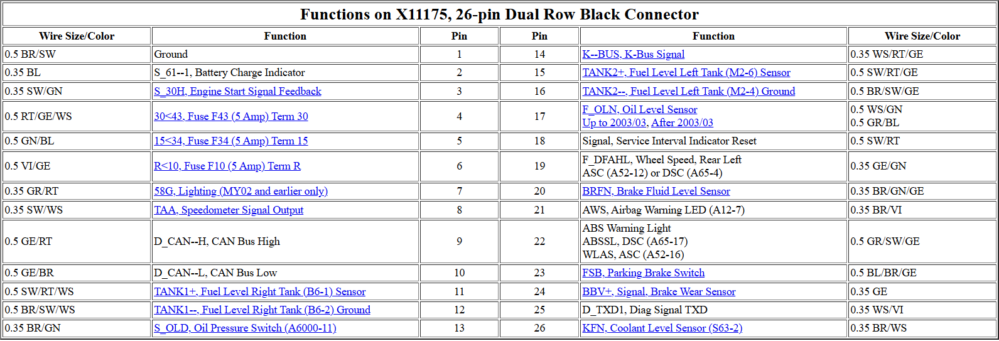
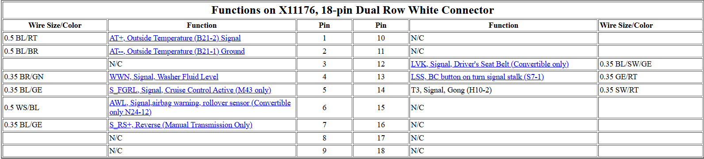
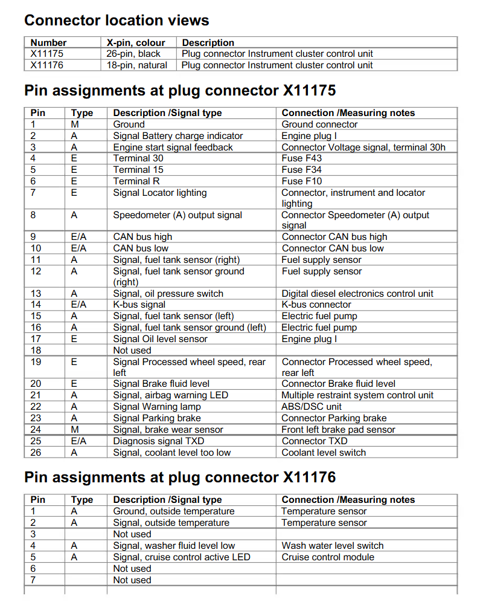
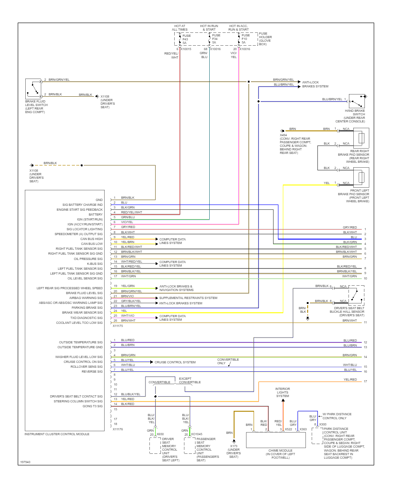
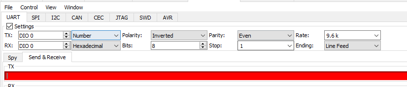
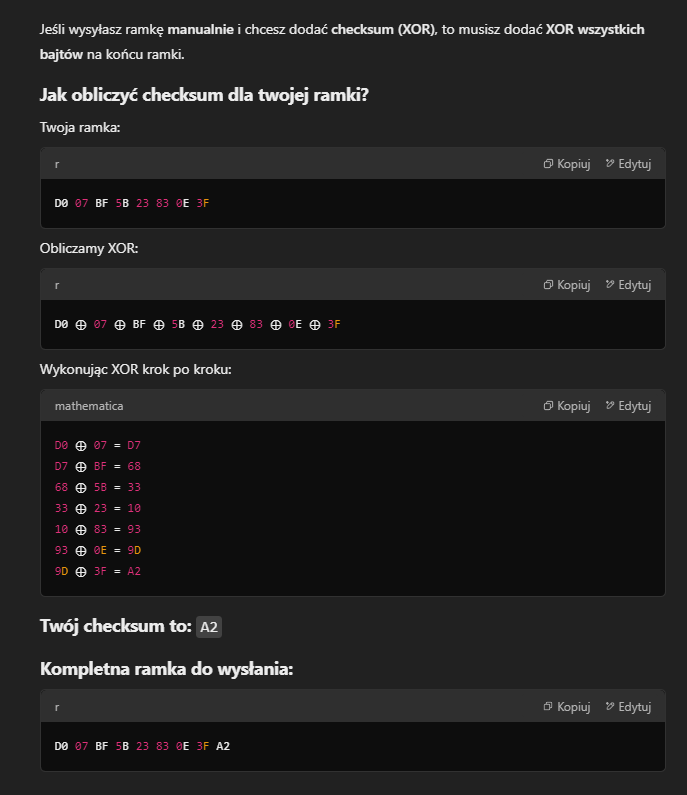
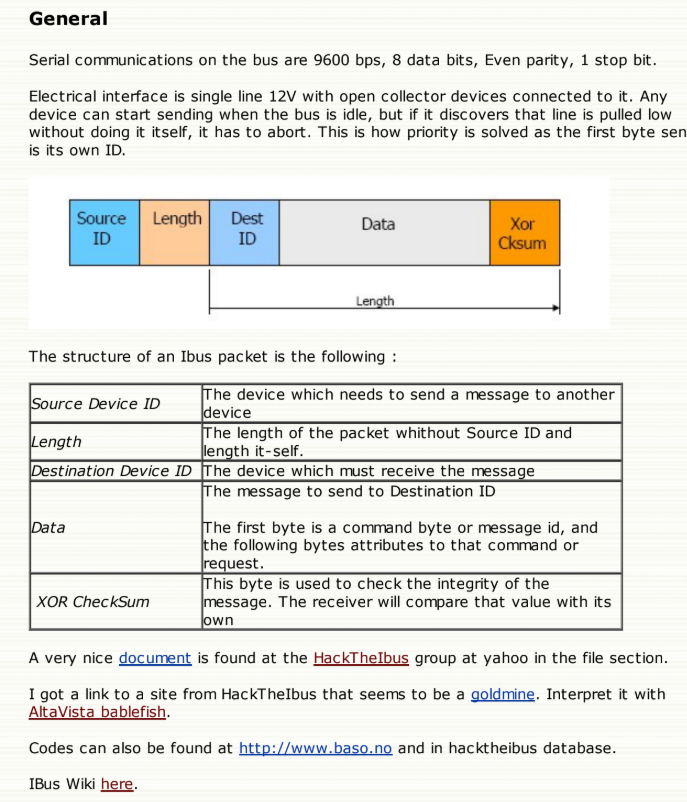
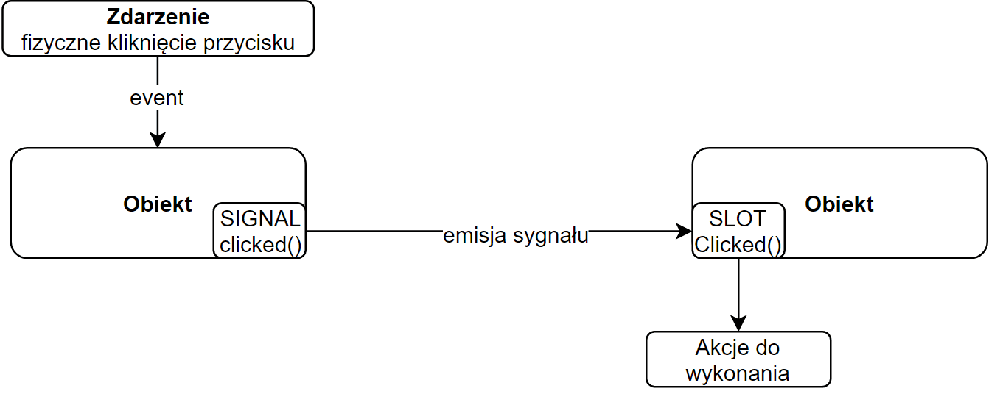

# BMW_E46_Gauge
Connecting e46 320D gauge to beamng drive

---

## Spis treści
1. [Schematic](#Schematic)
2. [Useful links](#Useful_links)
4. [Useful videos](#Useful_videos)
5. [Pinout](#Pinout)
6. [Photos](#Photos)
7. [Notes](#Notes)
8. [CAN Frames](#CAN_Frames)
9. [Qt App](#Qt_App)
10. [ESP CODE](#ESP_CODE)
11. [AT Comands](#AT_Comands)
12. [K bus](#K_bus)
13. [I2C](#I2C)
---

## Schematic


---

## Useful_links

- [Some forum](https://rusefi.com/forum/viewtopic.php?t=349)
- [Wiring](https://www.bmwgm5.com/E46_IKE_Connections.htm)
- [BMW WTD online](https://bmwteka.com/wds/en/e46/912c189d#)
- [XSimulator.net](https://www.xsimulator.net/community/threads/tacho-controller-arduino-e46-canbus.5463/)
- [e46 cluster controlled by stm32f4 via CAN bus](https://www.youtube.com/watch?v=_p4o54ZFcKQ&t=15s)
- [STM bluepill controling repo](https://github.com/chesapeakemotorwerks/bluepill_e46)
- [MS4x.net](https://www.ms4x.net/index.php?title=Main_Page)
- [KBUS ninja forum](https://curious.ninja/project/bmw-e46/e46-k-bus/arduino-bmw-i-bus-interface-technical-details/)
- [OutGauge UDP protocol](https://documentation.beamng.com/modding/protocols/)
- [Qt tutorial forbot](https://forbot.pl/blog/kurs-qt-3-pierwsza-aplikacja-mobilna-na-androida-id35602)
- [K-Bus repo](https://github.com/piersholt/wilhelm-docs)
- [K bus arduino](https://www.youtube.com/watch?v=amk5FXwBos8&ab_channel=Chuechco93)


---

## Useful_videos


---

## Pinout






---

## Photos

---

## Notes

- Washer fluid level is off (after a while) when shorted to GND with 2.2k resistor.
- 2 pin to GND - acumulator loading indicator on 
- 13 pin to GND - oil level indicator on
- 20 pin to GND - brake fluid level indicator off
- 22 pin to GND - ABS off 
- 24 pin to GND - coolant to low off
- 10ms SENDING SPEED!!!! for 0x316 and 0x545 and 0x329, 1000ms and at signal change for 0x338
- speed - frequency - 100Hz = 0km/h, 1770kHz for 255km/h
- OutGauge UDP protocol in beam ng drive
- k bus - 9600 baud rate inverted , even parity, 1 stop bit, line feed 
- pin 11,12 and 15,16 - 420 ohm resistor for full tank level
- pin 23 - parking brake
- pin 25 - diagnostic txd
- pin 21 - airbag 3 - engine feedback 17,18,8 - NC

- 21 + 3 = 24 pin connector 

 
 
 - left turn signal hD0 h07 hBF h5B h23 h83 h0E h3F hA2 

 - two devices UDP - use brodcast ip - 192.168.1.255

(Turn Right)
{0xD0 0x07 0xBF 0x5B 0x43 0x83 0x2E 0x3F 0xE2}

(Turn Left) 
{0xD0 0x07 0xBF 0x5B 0x23 0x83 0x0E 0x3F 0xA2}

(Hazard Lights)
{0xD0 0x07 0xBF 0x5B 0x63 0x83 0x0E 0x3F 0xE2}

(High Beam)
{0xD0 0x07 0xBF 0x5B 0x07 0x83 0x0A 0x3F 0x82}

(Stop Turning)
{0xD0 0x07 0xBF 0x5B 0x03 0x83 0x0A 0x3F 0x86}

(LCD Turn Off) - not working
{0x30, 0x19, 0x80, 0x1A, 0x30, 0x00, 0x20, 0x20, 0x20, 0x20, 0x20, 0x20, 0x20, 0x20, 0x20, 0x20, 0x20, 0x20, 0x20, 0x20, 0x20, 0x20, 0x20, 0x20, 0x20, 0x20, 0x83, 0x80, 0x04, 0x30, 0x1B, 0x00, 0x8F}




Outgauge protocole
```

typedef struct xxx {
    unsigned       time;            // time in milliseconds (to check order) // N/A, hardcoded to 0
    char           car[4];          // Car name // N/A, fixed value of "beam"
    unsigned short flags;           // Info (see OG_x below)
    char           gear;            // Reverse:0, Neutral:1, First:2...
    char           plid;            // Unique ID of viewed player (0 = none) // N/A, hardcoded to 0
    float          speed;           // M/S
    float          rpm;             // RPM
    float          turbo;           // BAR
    float          engTemp;         // C
    float          fuel;            // 0 to 1
    float          oilPressure;     // BAR // N/A, hardcoded to 0
    float          oilTemp;         // C
    unsigned       dashLights;      // Dash lights available (see DL_x below)
    unsigned       showLights;      // Dash lights currently switched on
    float          throttle;        // 0 to 1
    float          brake;           // 0 to 1
    float          clutch;          // 0 to 1
    char           display1[16];    // Usually Fuel // N/A, hardcoded to ""
    char           display2[16];    // Usually Settings // N/A, hardcoded to ""
    int            id;              // optional - only if OutGauge ID is specified
} xxx;
-- OG_x - bits for flags
local OG_SHIFT =     1  -- key // N/A
local OG_CTRL  =     2  -- key // N/A
local OG_TURBO =  8192  -- show turbo gauge
local OG_KM    = 16384  -- if not set - user prefers MILES
local OG_BAR   = 32768  -- if not set - user prefers PSI

-- DL_x - bits for dashLights and showLights
local DL_SHIFT        = 2 ^ 0    -- shift light
local DL_FULLBEAM     = 2 ^ 1    -- full beam
local DL_HANDBRAKE    = 2 ^ 2    -- handbrake
local DL_PITSPEED     = 2 ^ 3    -- pit speed limiter // N/A
local DL_TC           = 2 ^ 4    -- tc active or switched off
local DL_SIGNAL_L     = 2 ^ 5    -- left turn signal
local DL_SIGNAL_R     = 2 ^ 6    -- right turn signal
local DL_SIGNAL_ANY   = 2 ^ 7    -- shared turn signal // N/A
local DL_OILWARN      = 2 ^ 8    -- oil pressure warning
local DL_BATTERY      = 2 ^ 9    -- battery warning
local DL_ABS          = 2 ^ 10   -- abs active or switched off
local DL_SPARE        = 2 ^ 11   -- N/A

```
## CAN Frames

# DME1 0x316  

**Refresh Rate:** 10ms  

## Byte 0 - Bitfield  
| Bit  | Nazwa         | Opis |
|------|--------------|------|
| 0    | LV_SWI_IGK  | **Ignition Key Voltage State**<br>0 = terminal 15 off detected<br>1 = terminal 15 on detected |
| 1    | LV_F_N_ENG  | **Crankshaft Sensor State**<br>0 = no CRK error present<br>1 = CRK error present |
| 2    | LV_ACK_TCS  | **Traction Control State**<br>0 = either ASC1 was not received within the last 500 ms or it contains a plausibility error<br>1 = the ASC message ASC1 was received within the last 500 ms and contains no plausibility errors of the requirements TQI_ASR_CAN / TQI_MSR_CAN |
| 3    | LV_ERR_GC   | **Gear Change Error State**<br>0 = gear change not or partly possible<br>1 = gear change possible |
| 4-5  | SF_TQD [0]  | **Charge Intervention State**<br>0 = the required intervention can be performed completely or if there is no ASC requirement.<br>1 = the required intervention cannot be performed completely because the IGA retard limit is reached.<br>2 = the required intervention cannot be performed completely because the charge actuators are fully closed.<br>3 = "limited vehicle dynamics" is active (MTC/ISA error). |
| 6    | Unused      | - |
| 7    | LV_F_SUB_TQI | **MAF Error State**<br>0 = MAF ok<br>1 = MAF error present |

## Byte 1 - TQI_TQR_CAN  
**Indexed Engine Torque in % of C_TQ_STND** (including ASR/MSR/ETCU/LIM/AMT/GEAR intervention)  
**Calculation:** `HEX * 0.390625`  

## Byte 2-3 - N_ENG  
| Byte | Opis | Obliczenia |
|------|------|------------|
| 2    | N_ENG [LSB] |  |
| 3    | N_ENG [MSB] | **Engine Speed in rpm**<br>Calculation = `((HEX[MSB] * 256) + HEX[LSB]) * 0.15625` |

## Byte 4 - TQI_CAN  
**Indicated Engine Torque in % of C_TQ_STND** (based on PVS, N, AMP, TIA, TCO, IGA, PUC)  
**Calculation:** `HEX * 0.390625`  

## Byte 5 - TQ_LOSS_CAN  
**Engine Torque Loss** (due to engine friction, AC compressor, and electrical power consumption) in % of C_TQ_STND  
**Calculation:** `HEX * 0.390625`  

## Byte 6 - Bitfield  
| Bit  | Nazwa        |
|------|-------------|
| 6    | ERR_AMT_CAN |
| 7    | ERR_AMT_CAN |

## Byte 7 - TQI_MAF_CAN  
**Theoretical Engine Torque in % of C_TQ_STND** after charge intervention (based on MAF & IGA)  
**Calculation:** `HEX * 0.390625`  

# DME2 0x329  

**Refresh Rate:** 10ms  

## Byte 0 - Multiplexed Information  
| Bit  | Nazwa       | Opis |
|------|------------|------|
| 0-5  | MUX_INFO   | **Multiplexed Data** |
| 6    | MUX_CODE [0] |  |
| 7    | MUX_CODE [1] |  |
| **Wartości MUX_CODE** | |
| 0    | CAN_LEVEL  | CAN bus function level (always 0x11 for MS43) |
| 2    | OBD_STEUER | STATE_DIAG_GS (Status of GS diagnosis for feedback to gearbox) |
| 3    | MD_NORM    | Refactored C_TQ_STND from 0x3FF (0-1023Nm) to 0x3F (0-1008Nm) with decreased resolution of 16Nm |

## Byte 1 - TEMP_ENG  
**Engine (Coolant) Temperature in °C**  
**Calculation:** `(HEX * 0.75) - 48°C`  
- **Init:** `0xFF`  
- **Min:** `0x01` (-48°C)  
- **Max:** `0xFF` (142.5°C)  

## Byte 2 - AMP_CAN  
**Ambient Pressure in hPa**  
**Calculation:** `(HEX * 2) + 598hPa`  
- **Init:** `0x00`  
- **Min:** `0x01` (600hPa)  
- **Max:** `0xFE` (1106hPa)  
- **Error:** `0xFF`  

## Byte 3 - Bitfield  
| Bit  | Nazwa                | Opis |
|------|----------------------|------|
| 0    | LV_SWI_CLU          | **Clutch Switch State**<br>0 = released<br>1 = depressed |
| 1    | LV_LEVEL_IS         | **Idle Regulator State**<br>0 = idle above threshold<br>1 = idle below threshold |
| 2    | LV_ACK_CRU_AD_ECU   | **Acknowledge of ACC1 CAN Message**<br>0 = nACK<br>1 = ACK |
| 3    | LV_ERU_CAN          | **Engine Running State**<br>0 = engine stopped<br>1 = engine running |
| 4    | STATE_CRU_CAN ???   | - |
| 5-7  | STATE_MSW_CAN       | **Cruise Control Button State** |
| **Wartości STATE_MSW_CAN** | |
| 0    | No Button Pressed  | Init Value |
| 1    | Set / Acceleration | (tip-up) |
| 2    | Deceleration | (tip-down) |
| 3    | Resume | |
| 4    | Deactivate | (I/O) |
| 7    | Error Condition | |

## Byte 4 - TPS_VIRT_CRU_CAN  
**Throttle Position Sensor Virtual Cruise Control**  
**Calculation:** `HEX * 0.390625`  

## Byte 5 - TPS_CAN  
 **Accelerator Pedal Position in % of PVS_MAX**  
**Calculation:** `HEX * 0.390625`  
- **Init:** `0x00`  
- **Min:** `0x01` (0%)  
- **Max:** `0xFE` (99.2%)  
- **PVS Error:** `0xFF`  

## Byte 6 - Bitfield  
| Bit  | Nazwa          | Opis |
|------|--------------|------|
| 0    | LV_BS        | **Brake Switch State**<br>0 = brake not actuated<br>1 = brake actuated |
| 1    | LV_ERR_BS    | **Brake Switch System State**<br>0 = brake switch system OK<br>1 = brake switch system faulty |
| 2    | LV_KD_CAN    | **Kick Down State**<br>0 = kick down not active<br>1 = kick down active |
| 3-5  | STATE_CRU_CAN | **Cruise Control State** |
| **Wartości STATE_CRU_CAN** | |
| 0    | LV_CRU_ACT = 0  |  |
| 1    | LV_CRU_ACT = 1  | Constant drive (or tip-up / tip-down) |
| 3    | LV_CRU_ACT = 1  | Resume |
| 5    | LV_CRU_ACT = 1  | Set / Acceleration |
| 7    | LV_CRU_ACT = 1  | Deceleration |
| 6-7  | REQ_SHIFTLOCK | **Shift Lock Request** |
| **Wartości REQ_SHIFTLOCK** | |
| 0    | No actuation is active | |
| 3    | Actuation ISA, MTC, or N_SP_IS is active | |

## Byte 7 - Unused  


# DME3 0x338  

**Refresh Rate:** 1000ms and at signal change  

## Byte Allocation  
| Byte | Nazwa          | Opis |
|------|--------------|------|
| 0    | Unused       | - |
| 1    | Unused       | - |
| 2    | STATE_SOF_CAN | **Sport Button Status** |
| **Wartości STATE_SOF_CAN** | |
| 0    | Sport Button On  | (requested by SMG) |
| 1    | Sport Button Off | |
| 2    | Sport Button On  | |
| 3    | Sport Button Error | |
| **Init Value:** `0x01` | |
| 3    | Unused       | - |
| 4    | Unused       | - |
| 5    | Unused       | - |
| 6    | Unused       | - |
| 7    | Unused       | - |


# DME4 0x545  

**Refresh Rate:** 10ms  

## Byte 0 - Bitfield  
| Bit  | Nazwa                 | Opis |
|------|----------------------|------|
| 0    | Unused              | - |
| 1    | LV_MIL              | **Check Engine Light** |
| 2    | Unused              | - |
| 3    | LV_MAIN_SWI_CRU     | **CRU_MAIN_SWI** |
| 4    | LV_ETC_DIAG         | **EML Light** |
| 5    | Unused              | - |
| 6    | LV_FUC_CAN          | **Fuel Tank Cap Light** |
| 7    | Unused              | - |

## Byte 1-2 - FCO (Fuel Consumption)  
| Byte | Opis |
|------|------|
| 1    | FCO [LSB] |
| 2    | FCO [MSB] |

## Byte 3 - Bitfield  
| Bit  | Nazwa                        | Opis |
|------|-----------------------------|------|
| 0    | Oil Level Indicator LED     | **Oil consumption** |
| 1    | Oil Level Indicator LED     | **Oil loss** |
| 2    | Oil Level Indicator LED     | **Sensor malfunction** |
| 3    | LV_TEMP_ENG                 | **Coolant Overheating Light (c_tco_tmot_sta)** |
| 4-6  | M-Cluster Warm-Up LEDs      | **LED Warm-Up Indicator** |
| 7    | Upshift indicator           | **Shift Light** |

## Byte 4 - TOIL_CAN  
**Oil Temperature in °C**  
**Calculation:** `HEX - 48°C`  
- **Min:** `0x00` (-48°C)  
- **Max:** `0xFE` (206°C)  

## Byte 5 - Bitfield  
| Bit  | Nazwa                          | Opis |
|------|-------------------------------|------|
| 0    | Battery Charge Light          | **(Alpina Roadster Only)** |
| 1-7  | Unused                        | - |

## Byte 6 - Oil Level (MSS54HP only)  
**Calculation:** `(HEX - 158) / 10L`  
- **Min:** `0x80 || 0xC0` (-3.0L)  
- **Max:** `0xBE || 0xFE` (+3.2L)  

## Byte 7 - Bitfield  
| Bit  | Nazwa                          | Opis |
|------|-------------------------------|------|
| 0    | State Tire Pressure (MSS54 only) | **Tire Pressure Status** |
| 1-6  | Unused                        | - |
| 7    | Status Engine Oil Pressure Low | **Engine Oil Pressure Warning** |


# ASC1 0x153  

**Refresh Rate:** 10ms for ASC, 20ms for DSC  

## Byte 0 - Bitfield  
| Bit  | Name           | Description |
|------|----------------|-------------|
| 0    | LV_ASC_REQ     | **Demand for ASC intervention** |
| 1    | LV_MSR_REQ     | **Demand for MSR intervention** |
| 2    | LV_ASC_PASV    | **Status ASC passive (for EGS)** |
| 3    | LV_ASC_SW_INT  | **ASC Switching influence** |
| 4    | LV_BLS         | **Status Brake Light Switch** |
| 5    | LV_BAS         | - |
| 6    | LV_EBV         | - |
| 7    | LV_ABS_LED     | - |

## Byte 1 - Bitfield  
| Bit  | Name           | Description |
|------|----------------|-------------|
| 0    | LV_ASC_REQ     | - |
| 1    | LV_MSR_REQ     | - |
| 2    | LV_ASC_PASV    | - |
| 3-7  | VSS [0-4]      | **Vehicle Speed Signal** |

## Byte 2 - VSS [MSB]  
**Vehicle Speed Signal in Km/h**  
**Calculation:** `((HEX[MSB] * 256) + HEX[LSB]) * 0.0625`  
- **Min:** `0x160` (0 Km/h)  

## Byte 3 - MD_IND_ASC  
**Torque Intervention for ASC Function**  
**Calculation:** `HEX * 0.390625`  
- **Min:** `0x00` (0.0% max reduction)  
- **Max:** `0xFF` (99.6094% no reduction)  

## Byte 4 - MD_IND_MSR  
**Torque Intervention for MSR Function**  
**Calculation:** `HEX * 0.390625`  
- **Min:** `0x00` (0.0% no engine torque increase)  
- **Max:** `0xFF` (99.6094% max engine torque increase)  

## Byte 5 - Unused  

## Byte 6 - MD_IND_ASC_LM  
**Torque Intervention for ASC LM Function**  
**Calculation:** `HEX * 0.390625`  
- **Min:** `0x00` (0.0% max reduction)  
- **Max:** `0xFF` (99.6094% no reduction)  

## Byte 7 - ASC ALIVE  
**Alive Counter to Verify Message Integrity**  
- **Range:** `0x00` - `0x0F`  


## Qt App

- QML Qt Modelin Language - it is used for generating code for GUI 


-#pragma pack(push, 1) - sets the alignment of structure members to 1 byte, which means that the compiler does not add any additional bytes (padding) between structure fields.
-#pragma pack(pop) - restores the default alignment of structure members.

## ESP CODE

- HELLO WORLD
```
ets Jul 29 2019 12:21:46

rst:0xc (SW_CPU_RESET),boot:0x13 (SPI_FAST_FLASH_BOOT)
configsip: 0, SPIWP:0xee
clk_drv:0x00,q_drv:0x00,d_drv:0x00,cs0_drv:0x00,hd_drv:0x00,wp_drv:0x00
mode:DIO, clock div:2
load:0x3fff0030,len:6276
load:0x40078000,len:15716
load:0x40080400,len:4
ho 8 tail 4 room 4
load:0x40080404,len:3860
entry 0x4008063c
I (31) boot: ESP-IDF v5.4 2nd stage bootloader
I (31) boot: compile time Mar 19 2025 23:10:52
I (31) boot: Multicore bootloader
I (32) boot: chip revision: v3.1
I (35) boot.esp32: SPI Speed      : 40MHz
I (39) boot.esp32: SPI Mode       : DIO
I (42) boot.esp32: SPI Flash Size : 2MB
I (46) boot: Enabling RNG early entropy source...
I (50) boot: Partition Table:
I (53) boot: ## Label            Usage          Type ST Offset   Length
I (59) boot:  0 nvs              WiFi data        01 02 00009000 00006000
I (66) boot:  1 phy_init         RF data          01 01 0000f000 00001000
I (72) boot:  2 factory          factory app      00 00 00010000 00100000
I (79) boot: End of partition table
I (82) esp_image: segment 0: paddr=00010020 vaddr=3f400020 size=097e4h ( 38884) map
I (103) esp_image: segment 1: paddr=0001980c vaddr=3ff80000 size=0001ch (    28) load
I (103) esp_image: segment 2: paddr=00019830 vaddr=3ffb0000 size=02314h (  8980) load
I (110) esp_image: segment 3: paddr=0001bb4c vaddr=40080000 size=044cch ( 17612) load
I (121) esp_image: segment 4: paddr=00020020 vaddr=400d0020 size=133fch ( 78844) map
I (149) esp_image: segment 5: paddr=00033424 vaddr=400844cc size=08734h ( 34612) load
I (169) boot: Loaded app from partition at offset 0x10000
I (169) boot: Disabling RNG early entropy source...
I (179) cpu_start: Multicore app
I (188) cpu_start: Pro cpu start user code
I (188) cpu_start: cpu freq: 160000000 Hz
I (188) app_init: Application information:
I (188) app_init: Project name:     hello_world
I (192) app_init: App version:      0e5d73a-dirty
I (196) app_init: Compile time:     Mar 19 2025 23:10:41
I (201) app_init: ELF file SHA256:  b38304511...
I (206) app_init: ESP-IDF:          v5.4
I (209) efuse_init: Min chip rev:     v0.0
I (213) efuse_init: Max chip rev:     v3.99
I (217) efuse_init: Chip rev:         v3.1
I (221) heap_init: Initializing. RAM available for dynamic allocation:
I (227) heap_init: At 3FFAE6E0 len 00001920 (6 KiB): DRAM
I (232) heap_init: At 3FFB2BD0 len 0002D430 (181 KiB): DRAM
I (238) heap_init: At 3FFE0440 len 00003AE0 (14 KiB): D/IRAM
I (243) heap_init: At 3FFE4350 len 0001BCB0 (111 KiB): D/IRAM
I (249) heap_init: At 4008CC00 len 00013400 (77 KiB): IRAM
I (255) spi_flash: detected chip: generic
I (257) spi_flash: flash io: dio
W (260) spi_flash: Detected size(4096k) larger than the size in the binary image header(2048k). Using the size in the binary image header.
I (273) main_task: Started on CPU0
I (283) main_task: Calling app_main()
Hello world!
This is esp32 chip with 2 CPU core(s), WiFi/BTBLE, silicon revision v3.1, 2MB external flash
Minimum free heap size: 305356 bytes
Restarting in 10 seconds...
Restarting in 9 seconds...
Restarting in 8 seconds...
Restarting in 7 seconds...
```


working on at comands - custom at pins

https://docs.espressif.com/projects/esp-at/en/release-v2.4.0.0/esp32/Compile_and_Develop/How_to_clone_project_and_compile_it.html

env variable -   . $Env:IDF_PATH\export.ps1

cd ~/esp

git clone --recursive https://github.com/espressif/esp-at.git

change factory_param_data.csv in

C:\Users\patti\esp\esp-at\components\customized_partitions\raw_data\factory_param

to PLATFORM_ESP32,WROOM-32,"TX:17 RX:16",4,78,0,1,13,CN,115200,1,3,-1,-1

cd .\esp-at\

python build.py install

python build.py menuconfig 

disable bluetooth and at comands flow control

python build.py build

python build.py -p COM5 flash


## AT Comands

- AT - test
- AT+RST - reset
- AT+GMR - get version
- AT+CWMODE? - get wifi mode
- AT+CWMODE=1 - set wifi mode to station
- AT+CWJAP="SSID","PASSWORD" - connect to wifi
- AT+CIFSR - get ip
- AT+CIPSTART="UDP","0.0.0.0",12345,12345,2 - start udp server - now only this at stm start 
- AT+CIPRECVMODE=1 - set recive mode


h2B h49 h50 h44 h2C h39 h36 h3A h00 h00 h00 h00 h62 h65 h61 h6D h00 hC0 h02 h00 h55 hC5 hB5 h38 h32 hEE h1B h44 h00 h00 h00 h00 h96 h60 hD1 h41 h81 hA0 h7E h3F h00 h00 h00 h00 h5B h8E hE2 h41 h66 h07 h00 h00 h00 h00 h00 h00 h00 h00 h00 h00 h9A h99 h99 h3E h00 h00 h80 h3F h00 h00 h00 h00 h00 h00 h00 h00 h00 h00 h00 h00 h00 h00 h00 h00 h00 h00 h00 h00 h00 h00 h00 h00 h00 h00 h00 h00 h00 h00 h00 h00 h00 h00 h00 h00 


h2B h49 h50 h44 h2C h39 h36 h3A h00 h00 h00 h00 h62 h65 h61 h6D h00 hC0 h02 h00 h55 h18 h25 h39 h80 h6C h1C h44 h00 h00 h00 h00 h6F h62 hD1 h41 h79 hA0 h7E h3F h00 h00 h00 h00 h6D h90 hE2 h41 h66 h07 h00 h00 h00 h00 h00 h00 h00 h00 h00 h00 h9A h99 h99 h3E h00 h00 h80 h3F h00 h00 h00 h00 h00 h00 h00 h00 h00 h00 h00 h00 h00 h00 h00 h00 h00 h00 h00 h00 h00 h00 h00 h00 h00 h00 h00 h00 h00 h00 h00 h00 h00 h00 h00 h00     

## K Bus


# `0x5b` Cluster Indicators

LM `0xd0` → Broadcast `0xbf`

Activation of lighting related indicator lamps in the instrument cluster.

Additionally, activation of check control indicators lamps on low cluster (KOMBI), and check control messages (via discrete Check Control Module) on early E38s with high clusters (IKE).

### Related

- `0x5a` [Cluster Indicators Request](5a.md)
- `0x7a` [Door/Lid Status](../gm/7a.md)

### Examples
    
    # LCM_III
    D0 07 BF 5B 00 89 00 00 BA
    D0 07 BF 5B 01 C9 02 02 FB
    D0 07 BF 5B 80 20 00 00 93
    D0 07 BF 5B 00 8D 00 00 BE
    D0 07 BF 5B 00 00 00 00 33

    # LCM_IV
    D0 08 BF 5B 1B 00 00 40 00 67
    D0 08 BF 5B 00 00 00 00 00 3C
    D0 08 BF 5B 40 00 04 00 00 78
    D0 08 BF 5B 01 00 00 00 01 3C
    D0 08 BF 5B 03 00 00 00 01 3E

## Parameters

Fixed length, 4-byte bitfield for `LCM_III` (and I'd guess earlier variants).

    # Byte 1 (MSB)
    
    TURN_RAPID        = 0b1000_0000
    TURN_RIGHT        = 0b0100_0000
    TURN_LEFT         = 0b0010_0000
    FOG_REAR          = 0b0001_0000
    
    FOG_FRONT         = 0b0000_1000
    BEAM_HIGH         = 0b0000_0100
    BEAM_LOW          = 0b0000_0010
    PARKING           = 0b0000_0001
    
    # Byte 2
    
    CCM_LIC_PLATE     = 0b1000_0000
    CCM_TURN_RIGHT    = 0b0100_0000
    CCM_TURN_LEFT     = 0b0010_0000
    CCM_FOG_REAR      = 0b0001_0000
    
    CCM_FOG_FRONT     = 0b0000_1000
    CCM_HIGH_BEAM     = 0b0000_0100
    CCM_LOW_BEAM      = 0b0000_0010
    CCM_PARKING       = 0b0000_0001
    
    # Byte 3
        
    CCM_REVERSE       = 0b0010_0000
    
    INDICATORS        = 0b0000_0100
    CCM_BRAKE         = 0b0000_0010
    
    # Byte 4 (LSB)
    
    FOG_REAR_SWITCH   = 0b0100_0000
    KOMBI_LOW_LEFT    = 0b0010_0000
    KOMBI_LOW_RIGHT   = 0b0001_0000

    KOMBI_BRAKE_LEFT  = 0b0000_0010
    KOMBI_BRAKE_RIGHT = 0b0000_0001
    
    # Pending...
    # CCM_TAIL
    # CCM_TRAILER
    # KOMBI_BRAKE_CENTRE

`LCM_IV` and `LSZ_2` added a fifth byte.

    # Byte 5
    
    UNKNOWN           = 0b0000_0001


Send_KBUS_frame(LM, Broadcast, 0x5B, command, 0x00, 0x00, 0x04, 0x07); -> right rear light bulb warning
---

## I2C

default I2C addres on start: Znaleziono urządzenie na adresie: 0x2D / 00101101

I2C scan function

``` 
void I2C_Scan()
{
    printf("Skanowanie I2C...\r\n");
    for (uint8_t addr = 1; addr < 127; addr++)
    {
        if (HAL_I2C_IsDeviceReady(&hi2c1, (addr << 1), 1, 100) == HAL_OK)
        {
            printf("Znaleziono urządzenie na adresie: 0x%X\r\n", addr);
        }
    }
}

```
--- 
