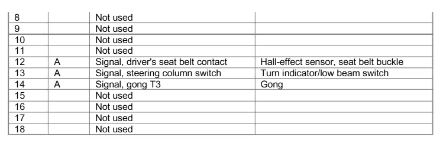

# BMW_E46_Gauge
Connecting e46 320D gauge to beamng drive

---

## Spis treści
1. [Schematic](#Schematic)
2. [Useful links](#Useful_links)
4. [Useful videos](#Useful_videos)
5. [Pinout](#Pinout)
6. [Photos](#Photos)
7. [Notes](#Notes)
8. [CAN Frames](#CAN_Frames)
9. [Qt App](#Qt_App)
---

## Schematic

---

## Useful_links

- [Some forum](https://rusefi.com/forum/viewtopic.php?t=349)
- [Wiring](https://www.bmwgm5.com/E46_IKE_Connections.htm)
- [BMW WTD online](https://bmwteka.com/wds/en/e46/912c189d#)
- [XSimulator.net](https://www.xsimulator.net/community/threads/tacho-controller-arduino-e46-canbus.5463/)
- [e46 cluster controlled by stm32f4 via CAN bus](https://www.youtube.com/watch?v=_p4o54ZFcKQ&t=15s)
- [STM bluepill controling repo](https://github.com/chesapeakemotorwerks/bluepill_e46)
- [MS4x.net](https://www.ms4x.net/index.php?title=Main_Page)
- [KBUS ninja forum](https://curious.ninja/project/bmw-e46/e46-k-bus/arduino-bmw-i-bus-interface-technical-details/)
- [OutGauge UDP protocol](https://documentation.beamng.com/modding/protocols/)
- [Qt tutorial forbot](https://forbot.pl/blog/kurs-qt-3-pierwsza-aplikacja-mobilna-na-androida-id35602)
- [K-Bus repo](https://github.com/piersholt/wilhelm-docs)
- [K bus arduino](https://www.youtube.com/watch?v=amk5FXwBos8&ab_channel=Chuechco93)

---

## Useful_videos

---

## Pinout

---

## Photos

---

## Notes

- Washer fluid level is off (after a while) when shorted to GND with 2.2k resistor.
- 2 pin to GND - acumulator loading indicator on 
- 13 pin to GND - oil level indicator on
- 20 pin to GND - brake fluid level indicator off
- 22 pin to GND - ABS off 
- 24 pin to GND - coolant to low off
- 10ms SENDING SPEED!!!! for 0x316 and 0x545 and 0x329, 1000ms and at signal change for 0x338
- speed - frequency - 100Hz = 0km/h, 1770kHz for 255km/h
- OutGauge UDP protocol in beam ng drive

## CAN Frames

# DME1 0x316  

**Refresh Rate:** 10ms  

## Byte 0 - Bitfield  
| Bit  | Nazwa         | Opis |
|------|--------------|------|
| 0    | LV_SWI_IGK  | **Ignition Key Voltage State** 0 = terminal 15 off detected 1 = terminal 15 on detected |
| 1    | LV_F_N_ENG  | **Crankshaft Sensor State** 0 = no CRK error present 1 = CRK error present |
| 2    | LV_ACK_TCS  | **Traction Control State** 0 = either ASC1 was not received within the last 500 ms or it contains a plausibility error 1 = the ASC message ASC1 was received within the last 500 ms and contains no plausibility errors of the requirements TQI_ASR_CAN / TQI_MSR_CAN |
| 3    | LV_ERR_GC   | **Gear Change Error State** 0 = gear change not or partly possible 1 = gear change possible |
| 4-5  | SF_TQD [0]  | **Charge Intervention State** 0 = the required intervention can be performed completely or if there is no ASC requirement. 1 = the required intervention cannot be performed completely because the IGA retard limit is reached. 2 = the required intervention cannot be performed completely because the charge actuators are fully closed. 3 = "limited vehicle dynamics" is active (MTC/ISA error). |
| 6    | Unused      | - |
| 7    | LV_F_SUB_TQI | **MAF Error State** 0 = MAF ok 1 = MAF error present |

## Byte 1 - TQI_TQR_CAN  
**Indexed Engine Torque in % of C_TQ_STND** (including ASR/MSR/ETCU/LIM/AMT/GEAR intervention)  
**Calculation:** `HEX * 0.390625`  

## Byte 2-3 - N_ENG  
| Byte | Opis | Obliczenia |
|------|------|------------|
| 2    | N_ENG [LSB] |  |
| 3    | N_ENG [MSB] | **Engine Speed in rpm** Calculation = `((HEX[MSB] * 256) + HEX[LSB]) * 0.15625` |

## Byte 4 - TQI_CAN  
**Indicated Engine Torque in % of C_TQ_STND** (based on PVS, N, AMP, TIA, TCO, IGA, PUC)  
**Calculation:** `HEX * 0.390625`  

## Byte 5 - TQ_LOSS_CAN  
**Engine Torque Loss** (due to engine friction, AC compressor, and electrical power consumption) in % of C_TQ_STND  
**Calculation:** `HEX * 0.390625`  

## Byte 6 - Bitfield  
| Bit  | Nazwa        |
|------|-------------|
| 6    | ERR_AMT_CAN |
| 7    | ERR_AMT_CAN |

## Byte 7 - TQI_MAF_CAN  
**Theoretical Engine Torque in % of C_TQ_STND** after charge intervention (based on MAF & IGA)  
**Calculation:** `HEX * 0.390625`  

# DME2 0x329  

**Refresh Rate:** 10ms  

## Byte 0 - Multiplexed Information  
| Bit  | Nazwa       | Opis |
|------|------------|------|
| 0-5  | MUX_INFO   | **Multiplexed Data** |
| 6    | MUX_CODE [0] |  |
| 7    | MUX_CODE [1] |  |
| **Wartości MUX_CODE** | |
| 0    | CAN_LEVEL  | CAN bus function level (always 0x11 for MS43) |
| 2    | OBD_STEUER | STATE_DIAG_GS (Status of GS diagnosis for feedback to gearbox) |
| 3    | MD_NORM    | Refactored C_TQ_STND from 0x3FF (0-1023Nm) to 0x3F (0-1008Nm) with decreased resolution of 16Nm |

## Byte 1 - TEMP_ENG  
**Engine (Coolant) Temperature in °C**  
**Calculation:** `(HEX * 0.75) - 48°C`  
- **Init:** `0xFF`  
- **Min:** `0x01` (-48°C)  
- **Max:** `0xFF` (142.5°C)  

## Byte 2 - AMP_CAN  
**Ambient Pressure in hPa**  
**Calculation:** `(HEX * 2) + 598hPa`  
- **Init:** `0x00`  
- **Min:** `0x01` (600hPa)  
- **Max:** `0xFE` (1106hPa)  
- **Error:** `0xFF`  

## Byte 3 - Bitfield  
| Bit  | Nazwa                | Opis |
|------|----------------------|------|
| 0    | LV_SWI_CLU          | **Clutch Switch State** 0 = released 1 = depressed |
| 1    | LV_LEVEL_IS         | **Idle Regulator State** 0 = idle above threshold 1 = idle below threshold |
| 2    | LV_ACK_CRU_AD_ECU   | **Acknowledge of ACC1 CAN Message** 0 = nACK 1 = ACK |
| 3    | LV_ERU_CAN          | **Engine Running State** 0 = engine stopped 1 = engine running |
| 4    | STATE_CRU_CAN ???   | - |
| 5-7  | STATE_MSW_CAN       | **Cruise Control Button State** |
| **Wartości STATE_MSW_CAN** | |
| 0    | No Button Pressed  | Init Value |
| 1    | Set / Acceleration | (tip-up) |
| 2    | Deceleration | (tip-down) |
| 3    | Resume | |
| 4    | Deactivate | (I/O) |
| 7    | Error Condition | |

## Byte 4 - TPS_VIRT_CRU_CAN  
**Throttle Position Sensor Virtual Cruise Control**  
**Calculation:** `HEX * 0.390625`  

## Byte 5 - TPS_CAN  
**Accelerator Pedal Position in % of PVS_MAX**  
**Calculation:** `HEX * 0.390625`  
- **Init:** `0x00`  
- **Min:** `0x01` (0%)  
- **Max:** `0xFE` (99.2%)  
- **PVS Error:** `0xFF`  

## Byte 6 - Bitfield  
| Bit  | Nazwa          | Opis |
|------|--------------|------|
| 0    | LV_BS        | **Brake Switch State** 0 = brake not actuated 1 = brake actuated |
| 1    | LV_ERR_BS    | **Brake Switch System State** 0 = brake switch system OK 1 = brake switch system faulty |
| 2    | LV_KD_CAN    | **Kick Down State** 0 = kick down not active 1 = kick down active |
| 3-5  | STATE_CRU_CAN | **Cruise Control State** |
| **Wartości STATE_CRU_CAN** | |
| 0    | LV_CRU_ACT = 0  |  |
| 1    | LV_CRU_ACT = 1  | Constant drive (or tip-up / tip-down) |
| 3    | LV_CRU_ACT = 1  | Resume |
| 5    | LV_CRU_ACT = 1  | Set / Acceleration |
| 7    | LV_CRU_ACT = 1  | Deceleration |
| 6-7  | REQ_SHIFTLOCK | **Shift Lock Request** |
| **Wartości REQ_SHIFTLOCK** | |
| 0    | No actuation is active | |
| 3    | Actuation ISA, MTC, or N_SP_IS is active | |

## Byte 7 - Unused  

# DME3 0x338  

**Refresh Rate:** 1000ms and at signal change  

## Byte Allocation  
| Byte | Nazwa          | Opis |
|------|--------------|------|
| 0    | Unused       | - |
| 1    | Unused       | - |
| 2    | STATE_SOF_CAN | **Sport Button Status** |
| **Wartości STATE_SOF_CAN** | |
| 0    | Sport Button On  | (requested by SMG) |
| 1    | Sport Button Off | |
| 2    | Sport Button On  | |
| 3    | Sport Button Error | |
| **Init Value:** `0x01` | |
| 3    | Unused       | - |
| 4    | Unused       | - |
| 5    | Unused       | - |
| 6    | Unused       | - |
| 7    | Unused       | - |

# DME4 0x545  

**Refresh Rate:** 10ms  

## Byte 0 - Bitfield  
| Bit  | Nazwa                 | Opis |
|------|----------------------|------|
| 0    | Unused              | - |
| 1    | LV_MIL              | **Check Engine Light** |
| 2    | Unused              | - |
| 3    | LV_MAIN_SWI_CRU     | **CRU_MAIN_SWI** |
| 4    | LV_ETC_DIAG         | **EML Light** |
| 5    | Unused              | - |
| 6    | LV_FUC_CAN          | **Fuel Tank Cap Light** |
| 7    | Unused              | - |

## Byte 1-2 - FCO (Fuel Consumption)  
| Byte | Opis |
|------|------|
| 1    | FCO [LSB] |
| 2    | FCO [MSB] |

## Byte 3 - Bitfield  
| Bit  | Nazwa                        | Opis |
|------|-----------------------------|------|
| 0    | Oil Level Indicator LED     | **Oil consumption** |
| 1    | Oil Level Indicator LED     | **Oil loss** |
| 2    | Oil Level Indicator LED     | **Sensor malfunction** |
| 3    | LV_TEMP_ENG                 | **Coolant Overheating Light (c_tco_tmot_sta)** |
| 4-6  | M-Cluster Warm-Up LEDs      | **LED Warm-Up Indicator** |
| 7    | Upshift indicator           | **Shift Light** |

## Byte 4 - TOIL_CAN  
**Oil Temperature in °C**  
**Calculation:** `HEX - 48°C`  
- **Min:** `0x00` (-48°C)  
- **Max:** `0xFE` (206°C)  

## Byte 5 - Bitfield  
| Bit  | Nazwa                          | Opis |
|------|-------------------------------|------|
| 0    | Battery Charge Light          | **(Alpina Roadster Only)** |
| 1-7  | Unused                        | - |

## Byte 6 - Oil Level (MSS54HP only)  
**Calculation:** `(HEX - 158) / 10L`  
- **Min:** `0x80 || 0xC0` (-3.0L)  
- **Max:** `0xBE || 0xFE` (+3.2L)  

## Byte 7 - Bitfield  
| Bit  | Nazwa                          | Opis |
|------|-------------------------------|------|
| 0    | State Tire Pressure (MSS54 only) | **Tire Pressure Status** |
| 1-6  | Unused                        | - |
| 7    | Status Engine Oil Pressure Low | **Engine Oil Pressure Warning** |

## Qt App

- QML Qt Modelin Language - it is used for generating code for GUI 

-#pragma pack(push, 1) - sets the alignment of structure members to 1 byte, which means that the compiler does not add any additional bytes (padding) between structure fields.
-#pragma pack(pop) - restores the default alignment of structure members.